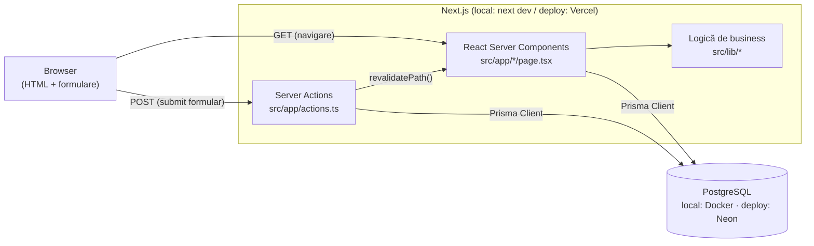
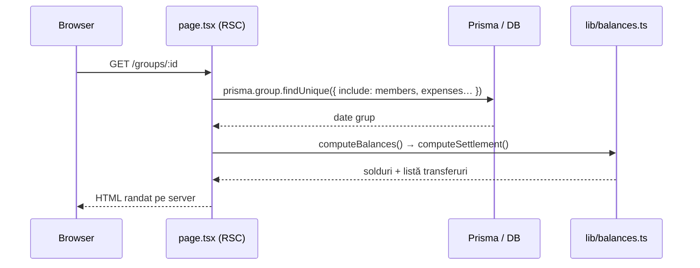
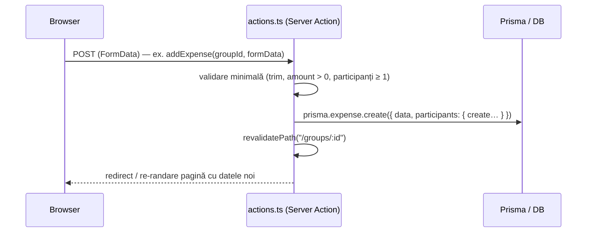
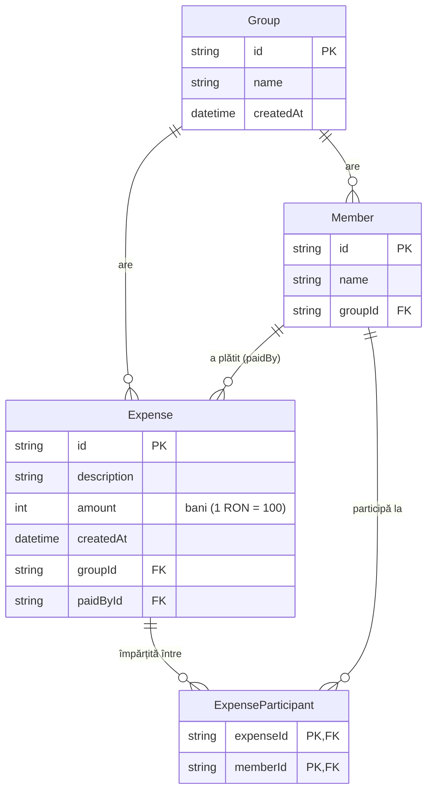
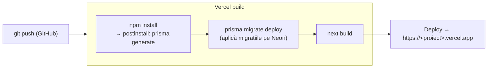

# Arhitectura proiectului

Document de referință pentru structura tehnică a aplicației. Pentru scopul
funcțional și fazele de implementare vezi [`spec.md`](./spec.md); pentru
pornire locală vezi [`README.md`](./README.md).

> **Stare curentă:** branch-ul `deploy-postgres` rulează pe **PostgreSQL**
> (local prin Docker, Neon la deploy pe Vercel) și se aduce pe `main` chiar
> înainte de publicare. Pașii de dashboard Vercel: [`DEPLOY.md`](./DEPLOY.md).
> Vezi și secțiunea [Build & deploy](#build--deploy).

## Privire de ansamblu

Aplicație Next.js (App Router) full-stack, fără backend separat: paginile
sunt React Server Components care citesc direct din baza de date prin Prisma,
iar mutațiile se fac prin Server Actions. Nu există API routes, nu există
autentificare.



## Stack

| Strat | Tehnologie |
| --- | --- |
| Framework | Next.js 16 (App Router, Turbopack) + TypeScript |
| UI | React 19 Server Components, Tailwind CSS v4 |
| Acces date | Prisma ORM 6 (generator `prisma-client`, output în `src/generated/prisma`) |
| Bază de date | PostgreSQL — local prin Docker (`postgres:16`), Neon la deploy |
| Hosting | local `next dev`; deploy: Vercel (plan Hobby) |

## Structură de directoare

```
src/
  app/
    layout.tsx            # root layout: fonturi Geist, <html>/<body>, metadata
    page.tsx              # "/"          — listă grupuri + creare grup
    groups/[id]/page.tsx  # "/groups/:id" — membri (editare/ștergere), solduri, settle-up, cheltuieli
    groups/[id]/expenses/[expenseId]/edit/page.tsx  # formular editare cheltuială
    confirm-button.tsx    # client component: confirm() înainte de submit-ul unei ștergeri
    actions.ts            # Server Actions: create/update/deleteGroup, add/update/deleteMember, add/update/deleteExpense
    globals.css           # Tailwind + variabile temă
  lib/
    prisma.ts             # singleton PrismaClient (evită connection leak în dev)
    balances.ts           # computeBalances + computeSettlement (funcții pure, fără I/O)
    money.ts              # toBani / formatBani (bani întregi, fără float)
  generated/prisma/       # client Prisma generat (gitignored, refăcut la `prisma generate`)
prisma/
  schema.prisma           # modelele de date (datasource: postgresql)
  migrations/             # istoric migrații SQL (dialect Postgres)
```

`src/lib/prisma.ts` e un singleton `PrismaClient` care citește
`DATABASE_URL` din mediu (pooled Neon pe Vercel, Postgres local altfel).
Singleton-ul e păstrat pe `globalThis` în afara producției ca `next dev` să
nu deschidă o conexiune nouă la fiecare hot-reload.

## Fluxul unui request

### Citire (navigare la o pagină)



Paginile se randează pe server la fiecare request (segment dinamic `[id]`
+ date citite per-request), deci lista de grupuri și soldurile sunt mereu
proaspete.

### Scriere (submit formular)



`createGroup` face `redirect()` către pagina noului grup, `deleteGroup` către
`/`, `updateExpense` înapoi către pagina grupului; celelalte acțiuni fac doar
`revalidatePath()` ca să reîmprospăteze pagina curentă. Input invalid ⇒
`return` silențios (formularele au `required` în HTML, deci UI-ul prinde
majoritatea cazurilor). Ștergerea unui membru implicat în cheltuieli e
blocată atât în UI (butonul e înlocuit de un mesaj) cât și în acțiune.

## Modelul de date



- Sumele se stochează ca **întregi în „bani"** (1 RON = 100 bani) ca să nu
  existe erori de rotunjire din float.
- `ExpenseParticipant` e tabel de legătură many-to-many cu cheie compusă
  `(expenseId, memberId)`. Prezența unui rând = membrul participă la
  împărțirea egală a acelei cheltuieli.
- `onDelete: Cascade` pe `groupId` și pe legăturile din `ExpenseParticipant`:
  ștergerea unui grup / a unei cheltuieli curăță automat rândurile dependente.
  Excepție: `Expense.paidBy` e `onDelete: Restrict` — un membru care a plătit
  o cheltuială nu poate fi șters. `deleteMember` verifică în plus și
  participările (`ExpenseParticipant` are `onDelete: Cascade` pe `memberId`,
  deci fără verificare ștergerea ar re-împărți silențios cheltuieli vechi).

## Logica de calcul (`src/lib/balances.ts`)

Funcții pure, testabile izolat, fără acces la DB — pagina le alimentează cu
datele deja încărcate.

1. **`computeBalances(members, expenses)`** — pentru fiecare membru:
   - `paid` = suma cheltuielilor plătite de el;
   - `owed` = suma share-urilor din cheltuielile la care participă, unde
     `share = amount / nrParticipanți` împărțit egal, iar restul din
     împărțirea întreagă se distribuie câte 1 ban primilor participanți
     (suma share-urilor = exact `amount`);
   - `net = paid - owed` (pozitiv = i se datorează, negativ = datorează).
2. **`computeSettlement(balances)`** — algoritm greedy de decontare:
   se sortează debitorii și creditorii descrescător după sumă și se
   potrivește cel mai mare debitor cu cel mai mare creditor, repetat, până
   la epuizare. Rezultă o listă minimală de transferuri „X îi dă lui Y suma Z".

Settle-up-ul e calculat **live** la fiecare afișare; nu există model de
plăți persistate (candidat pentru Faza 3).

## Build & deploy

Rularea locală e `next dev` pe un Postgres local (vezi `README.md`).
Publicarea pe Vercel + Neon trăiește pe branch-ul **`deploy-postgres`** și se
aduce pe `main` prin merge chiar înainte de deploy. Pașii de dashboard sunt
în [`DEPLOY.md`](./DEPLOY.md). Fluxul de build:



- `prisma/schema.prisma` pe `provider = "postgresql"`, cu `url` (pooled) și
  `directUrl` (unpooled, folosit de `migrate`); o singură migrație `init` în
  dialect Postgres;
- `DATABASE_URL` (pooled) + `DATABASE_URL_UNPOOLED` vin din integrarea Neon a
  Vercel; `DIRECT_URL` se setează manual la valoarea unpooled, ca
  `prisma migrate deploy` din pasul de build să aibă o conexiune directă;
- `npm run build` = `prisma migrate deploy && next build`;
- `src/lib/prisma.ts` citește doar `DATABASE_URL` din mediu (fără logică de
  path SQLite);
- paginile sunt oricum dinamice (`ƒ server-rendered on demand`), deci
  `next build` nu deschide conexiune la DB;
- clientul Prisma (`src/generated/prisma`, gitignored) se regenerează la
  fiecare build prin scriptul `postinstall`.

## Limitări cunoscute / decizii amânate

- Fără autentificare — oricine cu linkul unui grup îl poate edita (Faza 4).
- Validare minimală în Server Actions, fără mesaje de eroare inline în UI
  (dincolo de `required` HTML și de blocarea ștergerii unui membru implicat).
- Doar împărțire egală; fără sume/procente custom (Faza 2).
- Fără istoric de plăți — decontarea e doar calculată, nu se poate marca o
  datorie ca achitată (Faza 3).
- O singură valută (RON), fără categorii, fără export (Faza 5).
