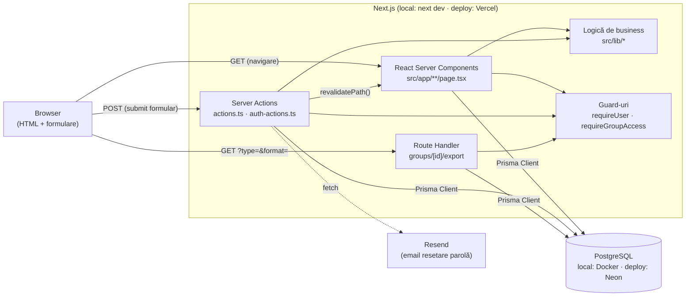
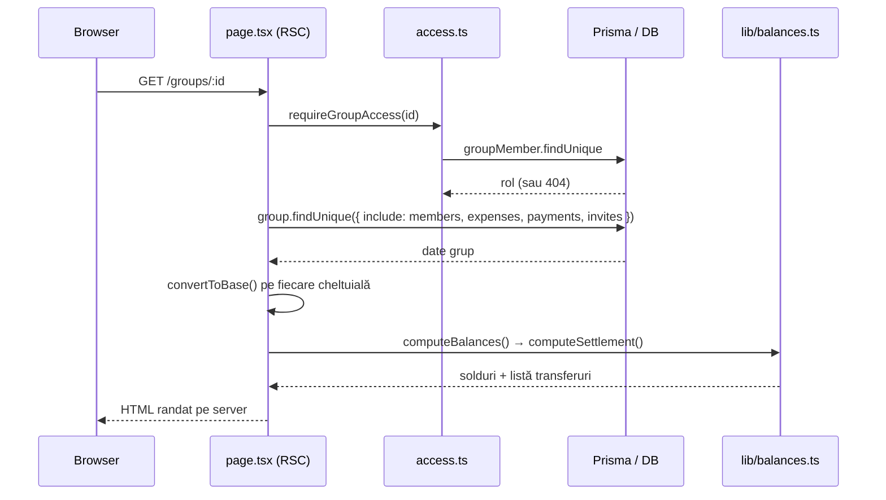
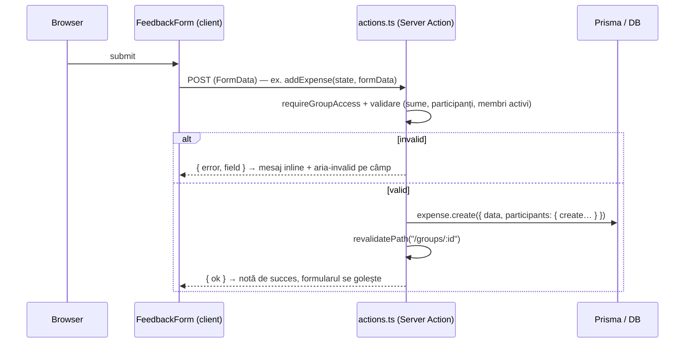
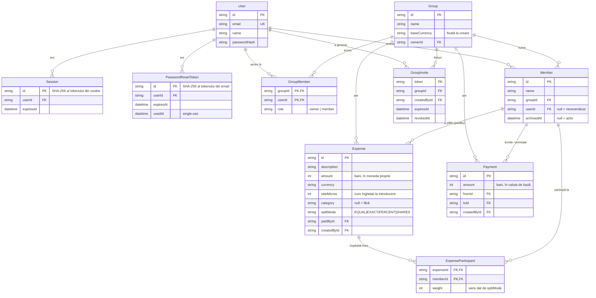
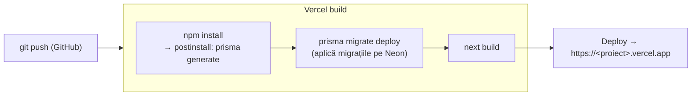

# Arhitectura proiectului

Document de referință pentru structura tehnică a aplicației. Pentru scopul
funcțional și fazele de implementare vezi [`spec.md`](./spec.md); pentru
pornire locală vezi [`README.md`](./README.md); pentru publicare vezi
[`DEPLOY.md`](./DEPLOY.md).

## Privire de ansamblu

Aplicație Next.js (App Router) full-stack, fără backend separat: paginile
sunt React Server Components care citesc direct din baza de date prin Prisma,
iar mutațiile se fac prin Server Actions. Singura rută HTTP scrisă de mână e
exportul CSV/PDF, care trebuie să întoarcă un fișier. Autentificarea e
implementată în casă (sesiuni opace în DB), fără librărie de auth.



## Stack

| Strat | Tehnologie |
| --- | --- |
| Framework | Next.js 16 (App Router, Turbopack) + TypeScript |
| UI | React 19 Server Components, Tailwind CSS v4 (prin `@tailwindcss/postcss`) |
| Acces date | Prisma ORM 6, generator `prisma-client` cu `engineType = "client"` (WASM query compiler + driver adapter, fără engine nativ), output în `src/generated/prisma` |
| Driver | `@prisma/adapter-pg` peste `pg` |
| Bază de date | PostgreSQL — local prin Docker (`postgres:16`), Neon la deploy |
| Autentificare | implementare proprie: sesiuni opace în DB + cookie httpOnly, hashing cu `node:crypto` (fără NextAuth) |
| Email | Resend, apelat prin `fetch` direct (fără SDK) |
| Testare | Vitest — două proiecte: `unit` (funcții pure) și `integration` (Postgres real) |
| Hosting | local `next dev`; deploy: Vercel (plan Hobby) |

Proiectul urmărește deliberat un minim de dependențe: în afară de Next, React
și Prisma nu există librării de UI, de state management, de validare sau de
auth.

## Structură de directoare

```
src/
  app/
    layout.tsx              # root layout: fonturi Geist, themeScript, metadata + viewport
    page.tsx                # "/"                    — listă grupuri + creare grup
    login/ register/        # autentificare / cont nou
    forgot-password/        # cerere link de resetare
    reset-password/[token]/ # alegere parolă nouă
    invite/[token]/         # acceptare invitație + revendicare nume
    groups/[id]/
      page.tsx              # pagina grupului: membri, cheltuieli, solduri, plăți, rezumat, invitații, export
      loading.tsx           # skeleton care oglindește layout-ul real
      expenses/[expenseId]/edit/page.tsx
      export/route.ts       # singurul Route Handler: CSV / PDF
    not-found.tsx           # 404 în română
    error.tsx               # eroare de randare într-un segment
    global-error.tsx        # eroare în root layout
    actions.ts              # Server Actions pe domeniul grup/membru/cheltuială/plată/invitație
    auth-actions.ts         # register, login, logout, requestPasswordReset, resetPassword
    form-state.ts           # tipul comun { ok } | { error, field? } întors de acțiuni
    *.tsx                   # componente client: expense-form, feedback-form, confirm-button,
                            # submit-button, quick-pay-form, copy-button, theme-toggle, …
    globals.css             # Tailwind + tokenii de temă + primitivele .btn/.field/.card
  lib/
    prisma.ts               # singleton PrismaClient peste adapterul pg
    auth.ts                 # sesiuni, hashing parole, tokeni de resetare, requireUser
    access.ts               # requireGroupAccess — apartenența la grup, memoizată per request
    safe-next.ts            # safeNext / loginRedirect — redirect post-login doar same-origin
    balances.ts             # splitAmount, computeBalances, computeSettlement (pure)
    money.ts                # parseDecimal, bani întregi, basis points, rate în micros
    currencies.ts           # codurile de valută acceptate + simboluri
    categories.ts           # slug-urile de categorie + etichete + iconițe
    summary.ts              # agregări pentru secțiunea „Rezumat"
    activity.ts             # merge cronologic cheltuieli + plăți pentru „Activitate recentă"
    invite.ts               # inviteContext — context de invitație afișat pe /login și /register
    relative-time.ts        # „acum 3 ore" în română
    romanian.ts             # dativul numelor proprii („îi dă Anei" / „îi dă lui Mihai")
    csv.ts · pdf.ts         # generarea exporturilor
    email.ts                # Resend prin fetch
  generated/prisma/         # client Prisma generat (gitignored, refăcut la `prisma generate`)
  test/                     # factories + setup pentru testele de integrare
prisma/
  schema.prisma             # modelele de date (datasource: postgresql)
  migrations/               # istoric migrații SQL
  seed.mjs                  # conturi + grup demo (`npm run db:seed`)
```

`src/lib/prisma.ts` e un singleton `PrismaClient` construit peste
`PrismaPg({ connectionString: DATABASE_URL })`. Generatorul rulează cu
`engineType = "client"`, deci nu există binar `libquery_engine` de împachetat
în funcțiile serverless de pe Vercel — clientul merge prin query compiler-ul
WASM și prin driver adapter. Singleton-ul e păstrat pe `globalThis` în afara
producției ca `next dev` să nu deschidă o conexiune nouă la fiecare
hot-reload.

## Cele trei niveluri de identitate

Distincția asta stă la baza întregului model de date și merită înțeleasă
înaintea diagramei:

| Model | Ce reprezintă |
| --- | --- |
| `User` | Contul: email, nume, hash de parolă. Există independent de orice grup. |
| `GroupMember` | Dreptul de **acces** al unui cont la un grup, cu `role` = `owner` \| `member`. |
| `Member` | Un **nume în grup** — o poziție în împărțeală. Poate exista fără cont (`userId: null`), pentru cineva care încă nu s-a înregistrat. |

Un om poate fi trecut în grup ca nume fără să aibă cont, iar un cont poate
avea acces fără să fie încă un nume în solduri. Legătura se face prin
`Member.userId`, setat când cineva **revendică** un nume la acceptarea unei
invitații.

Regula de aur: **calculele de bani lucrează cu `Member`, verificările de
permisiuni cu `GroupMember`.**

## Autentificare și autorizare

### Sesiuni

La login se generează un token random de 32 de octeți; în `Session.id` se
stochează **doar SHA-256-ul** lui, iar tokenul brut pleacă într-un cookie
`httpOnly` + `sameSite: lax` (și `secure` în producție), valabil 30 de zile.
Nimic nu e semnat, deci nu e nevoie de un secret de sesiune, iar o scurgere a
bazei nu poate fi rejucată ca sesiune validă. Sesiunile expirate se șterg
lazy, la prima citire.

`getCurrentUser()` e memoizat cu `cache()` din React, deci header-ul, pagina
și acțiunea împart un singur lookup pe request.

Parolele sunt hash-uite cu `scrypt` din `node:crypto` (salt de 16 octeți per
parolă, cheie de 64), stocate ca `saltHex:hashHex` și comparate în timp
constant cu `timingSafeEqual`.

### Resetare de parolă

Același tipar ca sesiunile: token random, doar hash-ul în
`PasswordResetToken` (valabil o oră), linkul brut trimis pe email prin
Resend. `usedAt` îl
face single-use chiar și sub cursă (verificat și setat în aceeași
tranzacție), iar orice token nefolosit anterior e șters la emiterea unuia nou.
`requestPasswordReset` întoarce mereu același mesaj generic și înghite
erorile de livrare, ca să nu poată fi folosit pentru a afla ce adrese au cont.

### Guard-uri

Nu există middleware. Autorizarea trece prin două funcții, apelate identic din
pagini, din acțiuni și din ruta de export:

- **`requireUser(next?)`** — fără sesiune ⇒ `redirect(loginRedirect(next))`.
  `next` e calea de întoarcere, ca un link partajat să supraviețuiască
  ocolului prin login; e sanitizată prin `safeNext` (doar căi absolute
  same-origin, respinge `//evil.com` și variantele cu backslash).
- **`requireGroupAccess(groupId)`** — cere o linie în `GroupMember`.
  Un non-membru primește **404, nu 403**, ca să nu afle nici măcar că grupul
  există. Memoizată cu `cache()`.

Peste asta, în interiorul grupului: **owner-ul poate modifica orice; un membru
simplu doar rândurile create de el** (`Expense.createdById` /
`Payment.createdById`). Rândurile fără creator înregistrat sunt owner-only.
Regula e implementată o dată, în `canMutate`, și aplicată atât în UI cât și în
acțiune.

## Fluxul unui request

### Citire (navigare la o pagină)



Paginile se randează pe server la fiecare request (segment dinamic + date
citite per-request), deci soldurile sunt mereu proaspete. Nu există stare pe
client și niciun fetch din browser.

### Scriere (submit formular)



Acțiunile întorc un `FormState` (`{ ok }` sau `{ error, field? }`), consumat
prin `useActionState`. `FeedbackForm` parcurge copiii formularului și pune
`aria-invalid` + `aria-describedby` pe câmpul numit în eroare, deci mesajul e
legat semantic de input.

`createGroup` face `redirect()` către noul grup, `deleteGroup` către `/`,
`updateExpense` înapoi către pagina grupului; restul fac doar
`revalidatePath()`.

Validarea e **dublă și independentă**: formularul ține butonul dezactivat cât
timp procentele nu fac 100 sau sumele exacte nu se potrivesc, iar acțiunea
revalidează totul pe server — inclusiv că fiecare id (plătitor și
participanți) e un membru activ al grupului. Fără acea verificare, un request
construit de mână ar putea introduce un membru străin, iar soldurile ar
înceta să însumeze zero.

## Modelul de date



Note pe model:

- Sumele se stochează ca **întregi în „bani"** (1 unitate = 100), niciodată
  ca float. Procentele sunt puncte de bază (1% = 100), cotele sunt numere
  întregi, iar cursurile sunt „micros" (curs × 1.000.000).
- `ExpenseParticipant.weight` își schimbă înțelesul după `Expense.splitMode`:
  1 pentru `EQUAL`, suma în bani pentru `EXACT`, puncte de bază pentru
  `PERCENT`, număr de cote pentru `SHARES`. Toate modurile ajung astfel în
  aceeași structură, iar `splitAmount` le tratează uniform.
- `Member.userId` are `@@unique([groupId, userId])`: un cont nu poate ocupa
  două nume în același grup, ceea ce acoperă și cursa dintre două acceptări
  simultane de invitație.
- `onDelete: Cascade` pe `groupId` și pe legăturile din
  `ExpenseParticipant`. Excepții: `Expense.paidBy` și ambele capete ale unui
  `Payment` sunt `Restrict` — un membru care apare în bani nu poate fi șters;
  `Member.userId` și `*.createdById` sunt `SetNull`.
- `Member.archivedAt` e alternativa la ștergere: istoricul rămâne intact, dar
  membrul dispare din pickere și din lista de solduri. Permis doar la sold
  net exact zero, altfel ar ascunde o datorie vie.

## Logica de calcul (`src/lib/balances.ts`)

Funcții pure, testabile izolat, fără acces la DB — pagina le alimentează cu
datele deja încărcate și deja convertite în valuta de bază.

1. **`splitAmount(total, weights)`** — împarte `total` proporțional cu
   `weights` și întoarce numere întregi de bani care însumează **exact**
   `total`. Banii rămași din diviziunea întreagă merg la participanții cu
   restul fracționar cel mai mare (egalitate ⇒ ordinea din listă). Așa, 10 lei
   la 3 oameni dau 3,34 / 3,33 / 3,33 — niciun ban pierdut sau inventat.
2. **`computeBalances(members, expenses, payments)`** — pentru fiecare membru
   calculează `paid`, `owed`, `sent`, `received` și
   `net = paid − owed + sent − received`. Plățile reale intră cu semn opus
   cheltuielilor, deci după ce toți s-au achitat toate net-urile sunt zero.
   Prin construcție, suma tuturor net-urilor e mereu zero.
3. **`computeSettlement(balances)`** — decontare greedy: se sortează
   debitorii și creditorii descrescător și se potrivește repetat cel mai mare
   debitor cu cel mai mare creditor. Nu e minimul teoretic de transferuri
   (problema e NP-hard), dar rezultă un număr mic, stabil și ușor de explicat:
   „X îi dă lui Y suma Z".

Butonul „marchează achitat" de pe un rând de decontare înregistrează exact acel
transfer ca `Payment`, după care rândul dispare la revalidare fiindcă soldul
s-a închis. Rândurile sunt cheiate pe perechea `debitor→creditor`, nu pe
index, altfel starea „achitat" ar rămâne lipită de rândul care alunecă în
locul celui rezolvat.

## Valute

Fiecare grup are o `baseCurrency` aleasă la creare și **neschimbabilă** după
aceea. O cheltuială poate fi în altă valută: își ține propriul cod și propriul
`rateMicros`, cursul fiind **înghețat la momentul introducerii**. O cheltuială
din vară nu se rescrie când se mișcă cursul.

Soldurile, decontarea, rezumatul și exportul lucrează toate în valuta de bază;
conversia se face cu `convertToBase(amount, rateMicros)` înainte de orice
agregare.

`parseDecimal` acceptă atât formatul românesc („1.234,56") cât și cel englezesc
(„1,234.56"), cu o euristică pentru cazul cu un singur separator și exact trei
cifre în coadă („1.500" ⇒ 1500, tratat ca grupare de mii). Formularul afișează
înapoi suma interpretată, ca ambiguitatea să fie vizibilă.

## Temă și UI

Tema e condusă de un atribut `data-theme` pe `<html>`, nu de media query, ca o
alegere manuală să poată depăși setarea sistemului:

- un script inline din `layout.tsx` rulează **înainte de prima pictare** și
  rezolvă alegerea salvată (`localStorage`, implicit `system`) în `light` sau
  `dark` — deci nu există flash;
- `ThemeToggle` ciclează `system → light → dark` și se sincronizează cu
  sistemul prin `useSyncExternalStore`;
- Tailwind e configurat cu `@custom-variant dark (&:where([data-theme="dark"], …))`,
  deci variantele `dark:` urmăresc atributul;
- `color-scheme` e îngustat per temă rezolvată, ca popup-urile native de
  `<select>`, scrollbar-ele, checkbox-urile și autofill-ul Chrome să urmeze
  pagina.

Culorile trec prin tokeni (`--color-border`, `--color-border-strong`,
`--color-surface`, `--color-muted`, `--color-accent`) aleși ca să treacă
WCAG AA în ambele teme: ~3:1 pentru conturul controalelor, ~7,5:1 pentru textul
secundar. Primitivele `.btn`, `.btn-primary`, `.btn-link-danger`, `.field` și
`.card` din `globals.css` țin raza, spațierea și chenarele uniforme; roșul e
rezervat acțiunilor distructive, iar verde/roșu apar altfel doar ca semn al
unui sold.

Accesibilitate: `:focus-visible` vizibil peste tot (cu un indigo mai deschis pe
fundal închis), dialogul de confirmare e `role="alertdialog"` cu focus pe
butonul distructiv și închidere pe `Escape`, iar erorile și confirmările de
formular sunt `role="alert"` / `role="status"`.

## Testare

`npm run check` = `tsc --noEmit && eslint && vitest run`.

Vitest rulează două proiecte:

- **`unit`** — funcțiile pure din `src/lib` (solduri, bani, CSV, PDF, rezumat,
  activitate, timp relativ, dativ românesc, `safeNext`). Fără I/O.
- **`integration`** — testele `*.integration.test.ts`, pe un **Postgres real**
  (`TEST_DATABASE_URL`, implicit baza `expense_splitter_test`). Schema e
  ștearsă și re-migrată la fiecare rulare, iar fișierele rulează secvențial.
  Acoperă Server Actions, autentificarea, controlul accesului și invitațiile.

## Build & deploy

Publicarea se face de pe `main`, pe Vercel + Neon. Pașii de dashboard sunt în
[`DEPLOY.md`](./DEPLOY.md).



- `npm run build` = `prisma migrate deploy && next build`;
- `DATABASE_URL` (pooled, prin PgBouncer) e ce folosește aplicația la runtime;
  `DIRECT_URL` (unpooled) e necesar lui `prisma migrate`, fiindcă DDL-ul cere o
  sesiune reală;
- `RESEND_API_KEY` (și opțional `RESEND_FROM`) pentru emailurile de resetare;
  fără el aplicația funcționează, doar că linkul nu pleacă;
- paginile sunt oricum dinamice, deci `next build` nu deschide conexiune la DB;
- clientul Prisma (`src/generated/prisma`, gitignored) se regenerează la
  fiecare build prin `postinstall`.

## Limitări cunoscute / decizii amânate

- **Notificări doar în aplicație.** „Activitate recentă" ține locul unui feed
  de notificări; nu există email sau push la o cheltuială nouă. Singurul email
  trimis e cel de resetare a parolei.
- **Cursuri introduse manual.** Nu există integrare cu un serviciu de cursuri
  valutare; utilizatorul tastează cursul, iar acesta rămâne înghețat pe
  cheltuială.
- **Fără paginare.** Pagina grupului încarcă toate cheltuielile și plățile
  odată. Suficient pentru dimensiunea vizată, dar nu pentru un grup foarte
  vechi.
- **Decontare greedy, nu optimă.** Vezi `computeSettlement`.
- **Aplicația cere JavaScript** pentru acțiunile distructive (dialogul de
  confirmare e o componentă client); fără JS ele sunt pur și simplu
  indisponibile, ceea ce e comportamentul sigur.
- **Un singur nivel de rol** (`owner` / `member`), fără roluri intermediare și
  fără transfer de proprietate asupra grupului.
